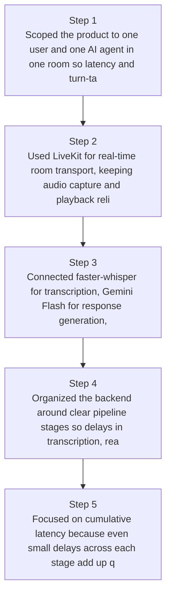
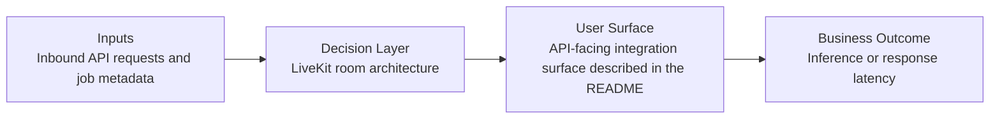
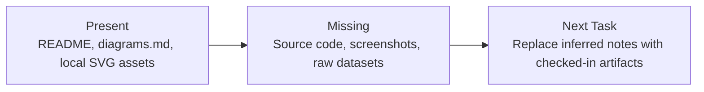

# Real-Time Voice Agent Diagrams

Generated on 2026-04-26T04:29:37Z from README narrative plus project blueprint requirements.

## STT → LLM → TTS pipeline latency breakdown

## LiveKit room architecture

## Evidence Gap Map

